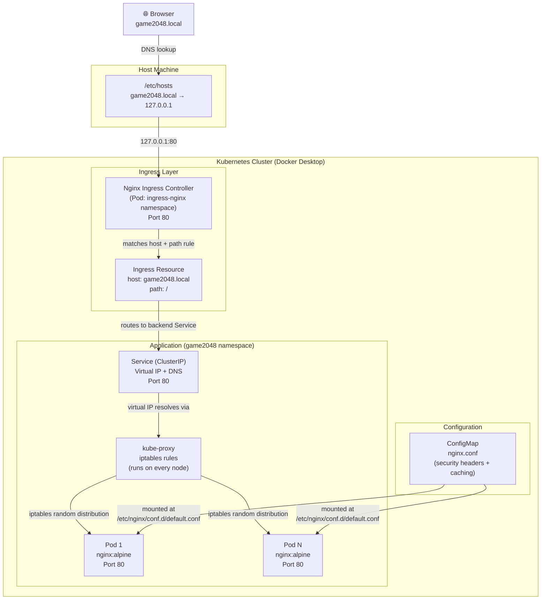

# Traffic Flow: Browser → App



## Component descriptions

| Component | Role |
|---|---|
| `/etc/hosts` | Maps `game2048.local` to `127.0.0.1` (local dev only) |
| **Nginx Ingress Controller** | Single entry point for all cluster traffic. Listens on host port 80, reads Ingress rules |
| **Ingress Resource** | Routing rule: requests for `game2048.local/` → forward to the `game2048` Service |
| **Service (ClusterIP)** | Stable virtual IP + DNS name (`game2048-game2048.game2048.svc.cluster.local`). Does NOT load balance by itself — it's just an address |
| **kube-proxy** | Runs on every node. Programs `iptables` rules that distribute traffic across all healthy pod IPs (random selection ≈ round-robin). This is the actual load balancer |
| **Pod (nginx:alpine)** | Serves the 2048 static HTML/JS/CSS files |
| **ConfigMap** | Custom `nginx.conf` — adds security headers (`X-Frame-Options`, `CSP`) and caching rules; mounted into every Pod |

## How the Ingress Controller knows which Service to use

The Ingress Resource (`ingress.yaml`) declares the backend explicitly:

```yaml
rules:
  - host: game2048.local
    http:
      paths:
        - path: /
          backend:
            service:
              name: game2048   # ← resolved by _helpers.tpl fullname
              port:
                number: 80
```

The controller reads this rule and forwards matching requests directly to that Service by name within the cluster DNS.
